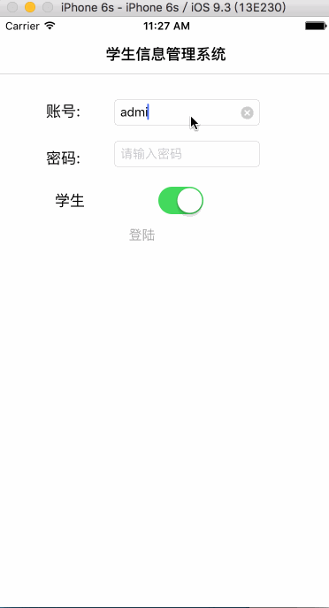

# Student-information-management-system
学生信息管理系统，界面采用Storyboard实现，基于FMDB实现数据库的增删查改功能。练习项目，欢迎Star。

#说明
数据库使用本地数据库，需要将数据库拷贝到程序
在Appdelegate中修改数据库路径即可

	在Appdelegate中，修改info.sqlite路径即可
    NSString *srcpath = @"Users/a3-7/Public/myproject/学生信息管理系统/学生信息管理系统/info.sqlite";
    

#第三方框架
- FMDB
- MBProgressHUD

#演示
- 管理员账号  admin ------ 123
- 学生账号 	 123   -----  123

